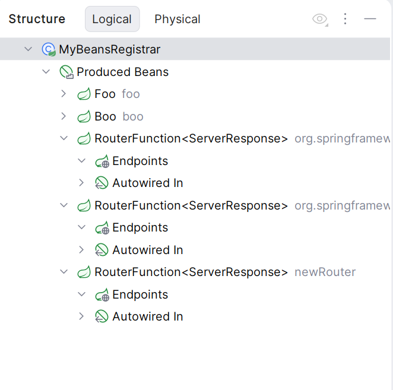

The programmatically registered routes support for Kotlin
in Spring Boot 4.0.0-SNAPSHOT (after https://github.com/spring-projects/spring-framework/issues/35694 update)

the endpoints are not shown in the registrar's Structure view any more:

--- FIXED

https://youtrack.jetbrains.com/issue/KTIJ-36070/Spring-Kotlin-DSL-no-Logical-Structure-for-programmatically-registered-route-functions-themselves
https://youtrack.jetbrains.com/issue/IDEA-383531/Spring-Kotlin-endpoints-are-not-shown-for-the-programmatically-registered-routes-that-are-companion-functions